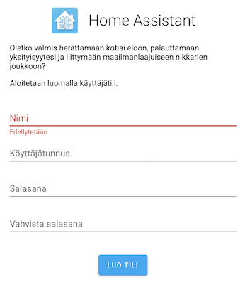

# KHT22 Raspberry Pie / Z-Wave

Instructions for setting up Raspberry Pi 4 for thermostat control.

These instructions are based on:

- [Install Home Assistant](https://www.home-assistant.io/getting-started/) (Home Assistant docs)

## Required

- Raspberry Pi single board computer
- Z-Wave adapter (Aeotec Z-Stick Gen5)
- Z-Wave peripherals (Aeotec Radiator Thermostat, Aeotec Multisensor 6)
- Micro-SD card[^1][^2][^3] ("32 GB or larger", "A2" application class)

>*⚠️ WARNING: A Raspberry Pi 4 package we bought (Dec 2019) contained an A1, 16 GB Micro-SD instead of the recommended 32 GB, A2. Check the details at ordering!*

[^1]: Read e.g. [this review](https://www.androidcentral.com/best-sd-cards-raspberry-pi-4) for tips on suitable cards. TL;DR Buy Samsung EVO+ 32 GB for ~10 Eur

[^2]: [Home Assistant Getting Started](https://www.home-assistant.io/getting-started/): *"Ideally get one that is Application Class 2 as they handle small I/O much more consistently than cards not optimized to host applications. A 32 GB or bigger card is recommended."*

[^3]: Home Assistant > [Hardware](https://www.home-assistant.io/docs/installation/#hardware) section recommends 1GB RAM, 32 GB storage

Computers for running the setup:

- Computer with SD adapter (macOS used)
- SD / MicroSD adapter
- HDMI display and adapter (any TV will do)
- USB keyboard

Models used:

- RPi 4 (4GB), with enclosure

Scalability: 

RPi 3/3+/4 are mentioned as *"a good starting point, and depending on the amount of devices you integrate this can be enough"* <sub>[source](https://www.home-assistant.io/docs/installation/#performance-expectations)</sub>. 

Z-Wave has a limit of >200 devices / network. Based on the above mention it can be that a Raspberry Pi would have challenges running such? Just need to test and see.


## Downloads

- The right [installation image](https://www.home-assistant.io/hassio/installation/) (Home Assistant)[^3image] 
  - used `hassos_rpi4-3.7.img.gz`
- [balenaEtcher](https://www.balena.io/etcher/); an Electron app (Windows/Linux/macOS) for flashing SD cards

[^3image]: Chose "Raspberry Pi Model B 32bit" since it was marked "recommended".


## Steps

### 1. Flash the card


### 2. WLAN (optional)

We skip this. If you cannot use Ethernet cable, see the [instructions](https://www.home-assistant.io/hassio/installation/) and [here](https://github.com/home-assistant/hassos/blob/dev/Documentation/network.md#wireless-wpapsk).

### 3. Power on!

Connect the RPi to a display, just to see what's happening.

In any case, [http://hassio.local:8123](http://hassio.local:8123) should soon show this:

>

*Note: ONLY use the Raspberry Pi power source for RPi4 (it didn't show any signs of life with a Mac USB-C source, so it's not only about current).*

When ready... you'll see this:

>

See [here](https://www.home-assistant.io/docs/authentication/).

Register. 

*Note: It's unclear to Asko (30-Dec-19) how much of this is local, whether some of it is in the cloud.*

When asked for devices, skip it for now. You should see something like this:

>

---

### Where are we now?

Hass.io is running. It starts at `http://hassio.local:8123` each time we turn the Raspberry Pi on.

We don't:

- have console (command line) access to Linux
- have devices installed

---

This would be a good time to explore the UI in the browser.

## Read the manuals

This might be a good time to read the [manuals](https://www.home-assistant.io/docs/). 

 
...


## Access management

<font color=red>tbd. The intention is to allow the Raspberry Pi to be visible only from within our housing compound network.

tbd. describe the steps</font>


<!-- tbd....
## Console access

Now that Raspberry Pi is running, you can open a terminal there:

```
-->


## Security

>*One major advantage of Home Assistant is that it’s not dependent on cloud services. Even if you’re only using Home Assistant on a local network, you should take steps to secure your instance.* <sub>[source](https://www.home-assistant.io/docs/configuration/securing/)</sub>

Check out [https://www.home-assistant.io/docs/configuration/securing/](https://www.home-assistant.io/docs/configuration/securing/).

### Hidden from the world

The approach taken at Katajaharjuntie 22 (housing compound) is to limit access to the Raspberry Pi to from-within IP's only.

<font color=red>tbd. Describe</font>


## Notes

The power supply needs to be "at least 2.5A" (instructions). Raspberry Pi's own is 3.1A. This is probably what you'll get from USB-C power supplies anyhow, but if you intend to run off a USB-A brick with a suitable cable, be aware.

In particular:

>⚠️ *If you are using a Raspberry Pi please remember to ensure you’re using an appropriate power supply with your Pi. Mobile chargers may not be suitable since some were only designed to provide just enough power to the device it was designed for by the manufacturer. Do not try to power the Pi from the USB port on a TV, computer, or similar.*

