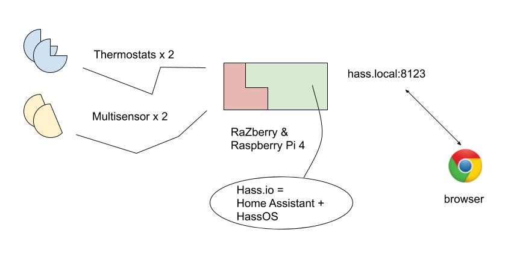

# Raspberry Pi / Z-Wave Setup

Instructions for setting up Raspberry Pi 4 for thermostat control.


## Aim

>

*Figure 1. Intended setup* <sub>[source](https://docs.google.com/drawings/d/1VIDgBshz0PvfjaUF_Vj0qP-S1wKMIlmiicpS6b2awuQ)</sub>

We aim to track one corridor's temperatures and control a few heating elements, during 2019-20 heating season.

This is a very basic setup for Home Assistant. This repo works as the log of what got done and how the system was set up. The repo is intended to be agnostic of the installation location and circumstances, but on the other hand we don't expect to build something generic.


### Story so far

Asko got the hardware by the end of 2019. 

Collaboration of the Aeotec Z-Stick Gen5 and Raspberry Pi 4 turned out to be impossible (without a USB hub in the middle) so it was changed into a [RaZberry](https://z-wave.me/products/razberry/) piggy-back board that happened to lie around. Ironically, ease of operation had been the main driver for getting the Aeotec stick.


## Required

- Raspberry Pi single board computer
- Z-Wave adapter (RaZberry)
- Z-Wave peripherals (Aeotec Radiator Thermostat, Aeotec Multisensor 6)
- Micro-SD card[^1][^2][^3] ("32 GB or larger", "A2" application class)
- Power source for Raspberry Pi 4

>*⚠️ WARNING: The Raspberry Pi 4 starter kit we bought (Dec 2019) contained an A1, 16 GB Micro-SD instead of the recommended 32 GB, A2. Check the details at ordering!*

[^1]: Read e.g. [this review](https://www.androidcentral.com/best-sd-cards-raspberry-pi-4) for tips on suitable cards. TL;DR Buy Samsung EVO+ 32 GB for ~10 Eur

[^2]: [Home Assistant Getting Started](https://www.home-assistant.io/getting-started/): *"Ideally get one that is Application Class 2 as they handle small I/O much more consistently than cards not optimized to host applications. A 32 GB or bigger card is recommended."*

[^3]: Home Assistant > [Hardware](https://www.home-assistant.io/docs/installation/#hardware) section recommends 1GB RAM, 32 GB storage

Computers for running the setup:

- Computer with SD adapter (macOS used)
- SD / MicroSD adapter
- HDMI display and adapter (any TV will do); if you are lucky, you can do without! :)
- USB keyboard; -''-

Models used:

- Raspberry Pi 4 (4GB)

>Note: ONLY use the Raspberry Pi power source for RPi4 (it didn't show any signs of life with a Mac USB-C source, so it's not only about current). Raspberry Pi 3's are way more adaptive, when it comes to powering them. 

## Downloads

- The right [installation image](https://www.home-assistant.io/hassio/installation/) (Home Assistant)[^3image] 
  - used `hassos_rpi4-3.7.img.gz`
- [balenaEtcher](https://www.balena.io/etcher/); an Electron app (Windows/Linux/macOS) for flashing SD cards

[^3image]: Chose "Raspberry Pi Model B 32bit" since it was marked "recommended".


## Steps

Based on:

- [Install Home Assistant](https://www.home-assistant.io/getting-started/) (Home Assistant docs)

### 1. Flash the card


### 2. WLAN (optional)

We skip this. If you cannot use Ethernet cable, see the [instructions](https://www.home-assistant.io/hassio/installation/) and [here](https://github.com/home-assistant/hassos/blob/dev/Documentation/network.md#wireless-wpapsk).

<!-- draft
### 3. RaZberry preparation

Skip this if you are using an Aeotec Z-Stick Gen5 (via a hub or on a RPi 3).

The device needs one line to be added to `config.txt` on the flashed SD Card.
-->

### 3. Power on!

Connect the RPi to a display, just to see what's happening (optional).

In any case, [http://hassio.local:8123](http://hassio.local:8123) should soon show this:

>

When ready... you'll see this:

>

See [here](https://www.home-assistant.io/docs/authentication/).

Register. This is only for the local instance of Home Assistant, not any cloud account.

When asked for devices, skip it for now. You should see something like this:

>

---

Hass.io is now running. It starts at `http://hassio.local:8123` each time we turn the Raspberry Pi on.

We don't:

- have console (command line) access to Linux
- have devices installed

---

This would be a good time to explore the UI in the browser.


### 4. Ssh access

It would be nice to have console access to the Raspberry Pi. Here's how to do it:

- Hass.io > Add-on Store > (install "SSH Server" plugin)[^5ssh]
- Hass.io > Dashboard > SSH Server

  

  - Have an SSH key pair available, or [generate one](https://help.github.com/en/github/authenticating-to-github/generating-a-new-ssh-key-and-adding-it-to-the-ssh-agent) (GitHub docs)
  - Enter the public key into "Config" section, as instructed on the page.
  - Make sure the plugin is started.

- Hass.io > System > Host system > Reboot
  - Seems to need this, otherwise Web UI gave "502".

- (after reboot) Hass.io > SSH Server > Open Web UI
  - You should get a command prompt
  - Try also from the PC/Mac: `$ ssh root@hassio.local`.

Click `Terminal` and you are able to e.g. check that the Home Assistant configuration is healthy:


>NOTE: You can now edit Hass.io config remotely. SSH also allows one to map the file system if you wish so (see sshfs); you don't need Samba. However: *"This add-on will not enable you to install packages or do anything as root.”*, i.e. you are SSH'ing to within Home Assistant, NOT within the Raspberry Pi itself.

[^5ssh]: I also tried "SSH & Web Terminal" but ended up using this on.

#### Ssh to host (HassOS)


## Read the manuals

This might be a good time to read the [manuals](https://www.home-assistant.io/docs/). They are really rather good. :)

*...(hours later)...*


## Adding the Z-Stick Gen5

Z-Wave devices need an adapter to be used from a Raspberry Pi. The one we have is an Aeotec [Z-Stick Gen5](https://aeotec.com/z-wave-usb-stick/) USB accessory.

Adding this to Home Assistant:

<!-- disabled (wasn't easy :( )
>*"You do not need to install any software to use Z-Wave."* <sub>[source](https://www.home-assistant.io/docs/z-wave/installation/)</sub>

Yayyy! 😊
-->

1. Add a section to `configuration.yaml`:

  ```
  zwave:
    usb_path: /dev/ttyACM0
    network_key: "0x01, 0x02, 0x03, 0x04, 0x05, 0x06, 0x07, 0x08, 0x09, 0x0A, 0x0B, 0x0C, 0x0D, 0x0E, 0x0F, 0x10"
  ```

  Note: edit some of the `.network_key` values, to make it unique (secret) to you. **Keep a backup** - if you were to need to start from scratch, you'd need this to communicate with devices if they've been tied with secrecy.
  
  I also created that `.yaml` file so it's there if I plan to use it.
  
2. Attach the Aeotec Z-Stick Gen5 to the Raspberry Pi

3. Hass.io > System > Reboot (not sure if this was needed)

<!-- disabled
You'll see the Stick in Configuration > Integrations:


-->

You'll see the Stick in Configuration > Z-Wave:


<font color="red" size="+2">Q: Is this normal??? I don't have "add node" or any such buttons, as are implied here:

>
</font>

---

This may be relevant:

[SOLVED: Can’t get Aoetec Z-Stick to work with HassOS](https://community.home-assistant.io/t/solved-cant-get-aoetec-z-stick-to-work-with-hassos/141227) (Oct 2019)

>*"Under Configuration>Devices, do you see AEON Labs ZW090 Z-Stick Gen5 US? If you click on it, and click again on the Z-Wave icon, you should see the status card for the device. Toward the top of the card, it should say ready."*

Nothing shows under Configuration > Devices:

>

---

This is what it's all about:

- [AEOTEC USB Zwave module not creating /dev/ttyACM0](https://github.com/raspberrypi/linux/issues/3027) (raspberrypi/linux GitHub Issues)
  - [a thread at Raspberry Pi forums](https://www.raspberrypi.org/forums/viewtopic.php?f=28&t=245031#p1502030), linked from the above issue

It's an electric mismatch, looks like the fault would be on Aeotec's side, or just the combination of them and Raspberry Pi 4. 

The only work-arounds currently available (Dec 2019) involve USB 2.0 hubs. That won't do it for me - returning the Z-Stick Gen 5.

---


## Access management

<font color=red>tbd. The intention is to allow the Raspberry Pi to be visible only from within our housing compound network.

tbd. describe the steps</font>


<!-- tbd....
## Console access

Now that Raspberry Pi is running, you can open a terminal there:

```
-->


## Security

>*One major advantage of Home Assistant is that it’s not dependent on cloud services. Even if you’re only using Home Assistant on a local network, you should take steps to secure your instance.* <sub>[source](https://www.home-assistant.io/docs/configuration/securing/)</sub>

Check out [https://www.home-assistant.io/docs/configuration/securing/](https://www.home-assistant.io/docs/configuration/securing/).

### Hidden from the world

The approach taken at Katajaharjuntie 22 (housing compound) is to limit access to the Raspberry Pi to from-within IP's only.

<font color=red>tbd. Describe</font>


## Notes

### Raspberry Pi 4 power

The power supply needs to be "at least 2.5A" (instructions). Raspberry Pi's own is 3.1A. This is probably what you'll get from USB-C power supplies anyhow, but if you intend to run off a USB-A brick with a suitable cable, be aware.

In particular:

>⚠️ *If you are using a Raspberry Pi please remember to ensure you’re using an appropriate power supply with your Pi. Mobile chargers may not be suitable since some were only designed to provide just enough power to the device it was designed for by the manufacturer. Do not try to power the Pi from the USB port on a TV, computer, or similar.*

### Z-Wave mesh nature

>*"Any device that’s permanently powered (not battery powered) will help build the mesh"* <sub>[source](https://www.home-assistant.io/docs/z-wave/)</sub>

This means while Z-Wave is a mesh network, it's not *automatically* that. E.g. thermostats won't relay data - they need to hear the main hub.

The Aeotec Multisensors can be powered over USB. If you can do this, they will likely work as mesh relays.[^6notes]

[^6notes]: Needs to be checked. Our initial pilot is small enough that all devices likely hear the hub?


### Z-Wave Plus

Be aware that the benefits of Z-Wave Plus (see [here](https://www.home-assistant.io/docs/z-wave/devices/#z-wave-plus)) are only available if *all* the devices are Z-Wave Plus.


### Instant Status

>*"As long as your device lists Hail or Association in its Controlled Command Classes, then you’ll get instant status updates."* <sub>[source](https://www.home-assistant.io/docs/z-wave/devices/#instant-status)</sub>

### Aeotec Z-Stick Gen5

Home Assistant [Z-Wave Device Specific Settings](https://www.home-assistant.io/docs/z-wave/device-specific/#aeotec-z-stick) have good stuff e.g. about the Aeotec stick.

#### Disabling the "disco lights" (FAILED!)

Unfortunately, the instructions don't apply when set up with Hass.io (we don't see the actual Linux dev's in the Hass.io terminal).

More instructions [here](echo -e -n "\x01\x08\x00\xF2\x51\x01\x00\x05\x01\x51" > /dev/serial/by-id/usb-0658_0200-if00).

I <strike>did</strike> tried to do it on macOS:

1. Detach the dongle, attach to the Mac
2. Follow instructions:

  ```
  $ echo -e -n "\x01\x08\x00\xF2\x51\x01\x00\x05\x01\x51" | cu -l /dev/cu.usbmodem14532401 -s 115200
cu: creat during lock (/var/spool/uucp/TMP000000c602 in /Users/asko/Git/kht22-rasppie-zwave as uid 501): Permission denied
cu: /dev/cu.usbmodem14532401: Line in use
  ```

  Don't know how to switch the LEDs off - may cover by a tape.


### Pairing by clicking the buttons (Aeotec Z-Stick Gen 5)

>*"Although possibly not recommended as mentioned by firstof9, I have successfully taken my z-stick out and used the ‘standard’ Aeotec pairing method for many devices. Once you plug it back into your HA server you need to do a reboot and then the new devices should come up in the z-wave config panel"* <sub>[source](https://community.home-assistant.io/t/solved-cant-get-aoetec-z-stick-to-work-with-hassos/141227/5)</sub>


